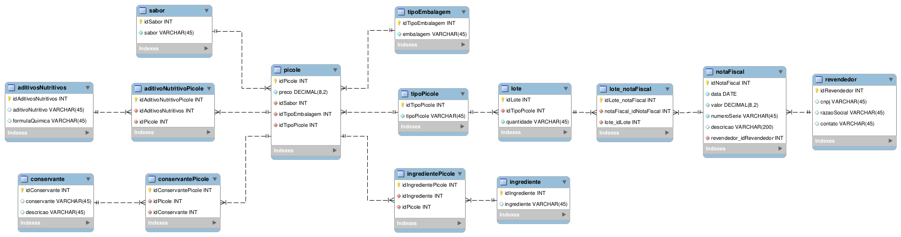

<h1 align="center"> Database para fábrica de picolés </h1>

  

> Estudo de caso para uma empresa fabricante de picolés, que deseja armazenar informações acerca de seus negócios. 

---
##### Sobre o levantamento de requisitos:
- Os picolés fabricados são divididos em normal (com água) e ao leite.
- As informações comuns armazenadas dos picolés são: sabor, ingredientes, preço e tipo da embalagem.
- Especificamente:
	- Picolés normais possuem um conjunto de aditivos nutritivos (vitaminas ou sais minerais) cada um com nome e fórmula química; 
	- Picolés ao leite contêm um conjunto de conservantes, cada um com nome e descrição. 
- Os dois tipos de picolés são vendidos em lotes exclusivos (ou normais, ou ao leite) para os revendedores e cada venda gera uma nota fiscal que pode conter um ou vários lotes.
- As notas fiscais possuem data, valor, número de série e descrição. 
- Todo revendedor possui uma pessoa de contato para eventuais resoluções de problemas, além disso, armazena-se do revendedor o CNPJ e a razão social.
- Deseja-se obter relatórios sobre as vendas mensais dos picolés de cada tipo e quais revendedores compraram mais picolés nos últimos meses.
---
### Quanto a ordem de desenvolvimento, o que está sendo feito:
- Criação da modelagem de dados:

